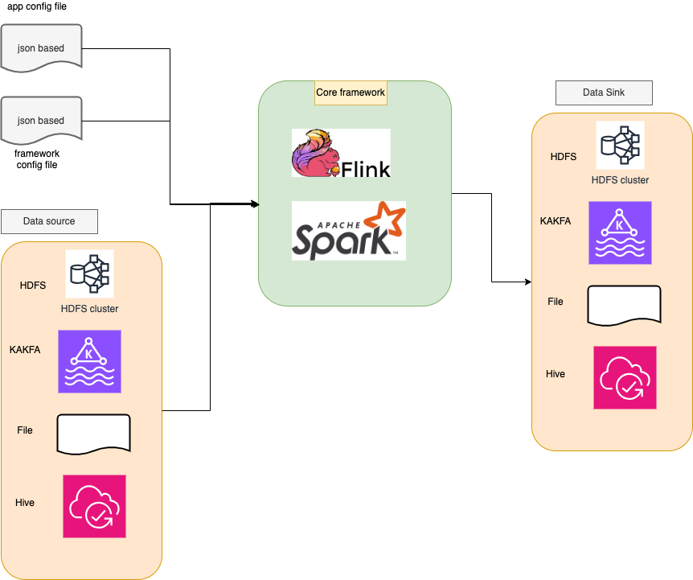

# streaming_framework
A config file based streaming framework based on flink and spark streaming

## Design pattern



### Problem statement

Solve real time processing for each appliction, no need to write the streaming code with spark streaming and flink, provide a framework that could be used repeatly, extract the core of `ETL` with configured based.

### Goal

Reduce the code side, and robust for each application, support both `Spark` and `Flink`, the reason to support 2 types of framework is currently most of bathed jobs is spark based, for flink is that less latency and high-throughout of streaming.

Both of frameworks support `SQL` logic.

Core of this framework define source, sink, with related transformations for the data stream.

User could just provide a config file that will define which platform to use with `spark` and `flink`, the framework will do the rest.

### Design

Config file based, one is for each application, the other is for the framework setting, so for each appilication could set some configs related to each apps.

- Application config -> business logic implement, with app name, queries, sources, sinks, transformations
- Framework config -> setup running environment for each apps, should support isolated for resource manager.

### Application setting

2 Types of logics are supported, but for each apps should be use one type of logic will be best practice!

Both `Spark Streaming` and `Flink` support these 2 types:

- **Data stream**
- **SQL based**
  

### Framework setting

Based on each framework logic that could config for all projects, that some of them could be overwritten based on each application.

Some of configs like `task manager resource`, `parallem`, `taskslots` etcs.

But most of them should be configured as default value, like `statebackend`, `recovery`, `high availability` etc.

#### Spark streaming

For spark streaming is batched based, some of configs should be configed in app side.

- batch_interval
  - a default value is 5s, could be overwriten in biz_config
  - should be balanced for latency and throughout
- checkpoint
  - a root path for app to store and high-avaiable
- resource config
  - numExecutors
  - executorCores
  - driverMemory
- deploy
  - master
  - deployMode
- Spark HA
  - WAL, write ahead log, for recovery
  - checkpointDir that will be used for recovery, for each application will have it's own
  - checkpointInterval, default is 1 mins, as batch_interval is 5s, so 5s * 10 = 50s, best practice is 5-10 batched to checkpoint
  - enable grace stop to ensure data processed.

```json
{
    "streaming": {
        "spark.streaming.checkpointInterval": "1 minutes",
        "spark.streaming.checkpointLocation": "hdfs://namenode:8020/user/spark/checkpoints",
        "spark.streaming.batchDuration": "10 seconds",
        "spark.streaming.gracefulShutdown.enabled": true,
        "spark.streaming.gracefulShutdown.timeout": "60 seconds",
        "spark.streaming.restartStrategy.attempts": 3,
        "spark.streaming.restartStrategy.delay": "10 seconds",
        "spark.streaming.checkpointCleaner.enabled": true,
        "spark.streaming.checkpointCleaner.cleanupInterval": "1 day",
        "spark.streaming.checkpointCleaner.retentionDuration": "7 days",
        "spark.streaming.monitoring.checkpointMetrics": true,
        "spark.streaming.recoveryMode": "CHECKPOINT",
        "spark.streaming.statePersistence.enabled": true,
        "spark.streaming.statePersistence.storageLevel": "MEMORY_AND_DISK_SER",
        "spark.sql.streaming.stateStore.providerClass": "org.apache.spark.sql.execution.streaming.state.HDFSBackedStateStoreProvider",
        "spark.streaming.backpressure.enabled": "true",
        "spark.streaming.kafka.maxRatePerPartition": "100",
        "spark.streaming.kafka.minRatePerPartition": "10",
        "spark.streaming.stopGracefullyOnShutdown": "true",
        "spark.sql.streaming.statefulOperator.checkCorrectness.enabled": "true",
        "spark.streaming.receiver.writeAheadLog.enable": "true",
        "spark.streaming.blockInterval": "200ms",
        "spark.streaming.unpersist": "true",
        "spark.streaming.kafka.consumer.poll.ms": "512",
        "spark.streaming.backpressure.initialRate": "50",
        "spark.sql.streaming.minBatchesToRetain": "10",
        "spark.sql.streaming.stateStore.maintenanceInterval": "2s"
    },
    "resources": {
        "spark.executor.memory": "4g",
        "spark.executor.cores": "2",
        "spark.driver.memory": "2g",
        "spark.driver.cores": "1",
        "spark.sql.shuffle.partitions": "200"
    }
}
```


#### Flink

Sample config, for statebackend should be a list of supported: memory, filesystem, rucksdb. But should support a default value, each app could have each own.

- stateBackend
  - list of supported: memory, filesystem, rucksdb
  - a root folder if is a path, each app will have it's own backend folder, with each time running will create it
- checkpoint
  - default interval with 6000s
  - default root path in HDFS to store
  - each app will have each own path
  - when to restore will use the latest one
- savepointPath
  - a root of full apps, each will have it's own path
  - when the app start, should save the job id to somewhere, then user could retrieve it, and see it in web, also could support savepoint to stop and start apps.
- highAvailability
  - based on zookeeper to avoid single point failure
  - stored in hdfs


```json
{
    "streaming": {
        "execution.checkpointing.interval": 60000,
        "execution.checkpointing.mode": "EXACTLY_ONCE",
        "execution.checkpointing.timeout": 600000,
        "execution.checkpointing.min-pause": 5000,
        "execution.checkpointing.max-concurrent-checkpoints": 1,
        "execution.checkpointing.externalized-checkpoint-retention": "RETAIN_ON_CANCELLATION",
        "execution.checkpointing.unaligned": true,
        "state.backend": "rocksdb",
        "state.checkpoints.dir": "/tmp/flink_checkpoints",
        "state.savepoints.dir": "/tmp/flink_checkpoints",
        "restart-strategy": "fixed-delay",
        "restart-strategy.fixed-delay.attempts": 3,
        "restart-strategy.fixed-delay.delay": "10 s",
        "execution.checkpointing.cleanup-mode": "retain_on_cancellation",
        "execution.checkpointing.tolerable-failed-checkpoints": 3,
        "execution.checkpointing.prefer-checkpoint-for-recovery": true,
        "execution.checkpointing.recover-without-channel-state": true,
        "state.backend.incremental": true,
        "execution.checkpointing.alignment-timeout": 20000,
        "state.backend.local-recovery": true,
        "execution.checkpointing.snapshot-compression": true
    },
    "resources": {
        "jobmanager.memory.process.size": "2048m",
        "taskmanager.memory.process.size": "4096m",
        "taskmanager.numberOfTaskSlots": 2,
        "parallelism.default": 2,
        "taskmanager.memory.network.fraction": 0.1,
        "taskmanager.memory.network.min": "64mb",
        "taskmanager.memory.network.max": "1gb",
        "taskmanager.memory.framework.heap.size": "128mb",
        "taskmanager.memory.task.heap.size": "512mb",
        "taskmanager.memory.task.off-heap.size": "0mb",
        "taskmanager.memory.managed.size": "512mb",
        "taskmanager.cpu.cores": 2.0
    },
    "high_availability": {
        "high-availability": "zookeeper",
        "high-availability.zookeeper.quorum": "zk1:2181,zk2:2181,zk3:2181",
        "high-availability.zookeeper.path.root": "/flink",
        "high-availability.cluster-id": "my-flink-cluster",
        "high-availability.storageDir": "hdfs://namenode:8020/flink/recovery",
        "high-availability.jobmanager.port": "50000-50100"
    }
}
```


### implement

Each of application could have it's own config to implement biz logic, from source, transformation, sink.

For each component support `DAG` and `Sequeence` logic, as each of component will have one id, will construct DAG object to represent logic.

As currently is streaming based, but for source and sink are kafka supported best! To ensure `extractly-once` logic!

- Source
  - File
  - Kafka
  - Hive
  - HDFS
- Transform
  - Data stream
    - map
    - filter
    - reduce
    - select
    - limit
    - drop
    - *
  - SQL
    - query based
    - support watermark for pylink in sql side if user provide need, constructed in framework code side
    - agg based with sql
- Sink
  - File
  - Kafka
  - Hive
  - HDFS


### Framework usibility
- Flink savepoint is based on each app with new name, a base state path and will create app folder, with each run will append savepoint to path, with job_id, user will get job_id based on REST API based on Flask. User could just call api with related config, then will start, resume, stop application with Flink Savapoint functionality.
- Flink state backend is pluggeble, with `memory`, `FS`, `Rocksdb` for state save, and provide a config to choose one.


### Framework ability
- Config file based for user query logic: `SQL` or `Transformation` operator
- Each application wil have it's own path for checkpoint, savepoint etc.
- Pre-defined HA configuration setting for spark and flink
- HA settings
  - Checkpoint setting, with duration, async type, checkpoint
  - State backend supported
  - Zookeeper setting for HA
  - Checkpoint TTL and cleanup
  - Exactly-once pipeline for kafka as source
  - Dynamic setting for resource-allocation
  - Spark gracely stop
  - Recovery settings
- A list of source and target file type supported
- Formatted logging
- Singleton for classes for logging, session, env etc.
- Dyanmic schema reference from kafka source and dump, for later step query setting, will try to send out kafka source schema
- A REST API for flink savepoint trigger
- etc.


### Feedback

For each project wil have it's own config, and will provide a `feedback` module to help user to get more insights.

### Real use case for projects

- Transaction filtering, alerting related
- Real time dashboard refreshing

